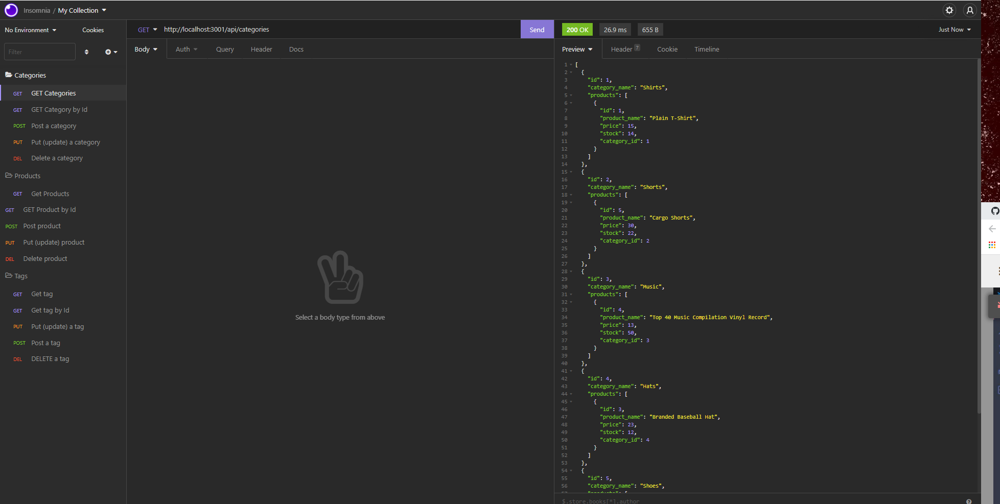

# E-commerce Back End 

## Description
Created to allow the user to make products, tags and categories in a quick an easy manner. 

## Table of Contents (Optional)
* [Installation](#installation)
* [Usage](#usage)
* [License](#license)
* [Contributing](#contributing)
* [Test](#test)
* [Questions](#questions)

## Installation
Clone the repo, then do "npm install". Change your password in the .env file. Then run "npm run seeds" to have the data auto populate. Next run "npm start" and open your Insomnia in order to testing and creating new data. 

## Usage
This is what it will look like on your device. 
[Screencastify](https://watch.screencastify.com/v/SE05c5dCk08aoj012U1r)

## License 
N/A

## Contributing
Jennifer Lucas 

## Tests 
N/A

## Questions
Please checkout my [Github](https://github.com/jenmlucas) for other projects. If you have any other questions or concerns, feel free to email me at jenmlucas1@gmail.com.

